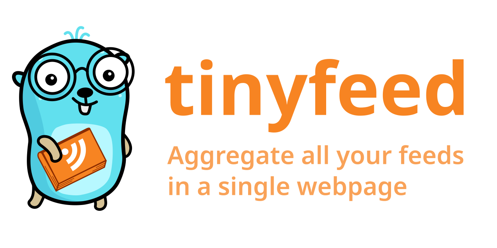

# tinyfeed 



**tinyfeed** is a CLI tool that generate a static HTML page from a collection of feeds.

You can effortlessly set it up in crond or systemd and direct your HTTP server 
to the generated `index.html` and voilà, you’ve got yourself a webpage 
that aggregate your feeds.

## Feature

- RSS, Atom and JSON feeds are all supported thanks to the awesome 
[gofeed library](https://github.com/mmcdole/gofeed)
- Highly customizable, especially with the ability to use external stylesheet and templates.
- Dark / Light theme based on system preference
- Generated page is lightweight and fully accessible
- Support a daemon mode to re-generate the output periodically

## Screenshot


## Usage

The CLI app is design to work with basic pipelining and stdout redirections. 

```
Usage:
  tinyfeed [FEED_URL ...] [flags]

Examples:
  single feed      tinyfeed lovergne.dev/rss.xml > index.html
  multiple feeds   cat feeds.txt | tinyfeed > index.html
  daemon mode      tinyfeed --daemon -i feeds.txt -o index.html 

Flags:
  -D, --daemon               Whether to execute the program in a daemon mode.
  -d, --description string   Add a description after the name of your page
  -h, --help                 help for tinyfeed
  -i, --input string         Path to a file with a list of feeds.
  -I, --interval int         Duration in minutes between execution. Ignored if not in daemon mode. (default 1440)
  -l, --limit int            How many articles to display (default 256)
  -n, --name string          Title of the page. (default "Feed")
  -o, --output string        Path to a file to save the output to.
  -q, --quiet                Add this flag to silence warnings.
  -r, --requests int         How many simulaneous requests can be made (default 16)
  -s, --stylesheet string    Path to an external CSS stylesheet
  -t, --template string      Path to a custom HTML+Go template file.
  -T, --timeout int          timeout to get feeds in seconds (default 15)
```

⚠️ When using a redirection directly, like in the example, your HTML page will be
blank while tinyfeed is processing and it will also stay blank if there is an error.
 To avoid that, use a tempory file: 

```bash
cat feeds | tinyfeed > /tmp/tinyfeed && mv /tmp/tinyfeed /path/to/index.html
```

## Installation

### Install from binary 

You can download the official binaries from the [releases page](https://github.com/TheBigRoomXXL/tinyfeed/releases/latest/). Currently only arm64 architecture on Linux, Mac and Windows, is
supported. If you need something else than that, please open an issue and I will
add it to the releases process.

Here is a quick example of how to install the binary for linux:

```bash
wget https://github.com/TheBigRoomXXL/tinyfeed/releases/latest/download/tinyfeed_linux_arm64
chmod +x tinyfeed_linux_arm64
sudo mv tinyfeed_linux_arm64 /usr/local/bin/tinyfeed
tinyfeed --help
```

If you are on Alpine you also need to install [gcompat](https://pkgs.alpinelinux.org/package/edge/main/x86_64/gcompat) to fix the usual musl / glibc compatibility
issues.

```bash
apk add gcompat
```

### Install with Go

```bash 
go install github.com/TheBigRoomXXL/tinyfeed@latest
```

## External HTML+Go template 

You can provide you own template for page generation. For an exemple template
check out the [built-in one](https://github.com/TheBigRoomXXL/tinyfeed/blob/main/built-in).
To learn about HTML+Go template check the [official documentation](https://pkg.go.dev/html/template). 

Inside you template you will have access to data with the following struct and functions:

```go
type data struct {
    Metadata map[string]string
    Items    []*gofeed.Item
    Feeds    []*gofeed.Feed
}

func publication(item *gofeed.Item) string

func domain(item *gofeed.Item) string
```


## Feedback, help or bug report

You have created a page with tinyfeed and you want to share it? You can open a
merge request or an issue to add it to the demo section. 

If you need anything related to this project wether it's' just giving feedback,
help to understand something or feature request just open a issue on this repos.


## Acknowledgement

The project was heavily inspired by [tinystatus](https://github.com/bderenzo/tinystatus), and message boards like Lobste.rs and Hacker News.

Thank you @MariaLetta for the awesome [free-gophers-pack ](https://github.com/MariaLetta/free-gophers-pack)
wich I adapted for the banner.
